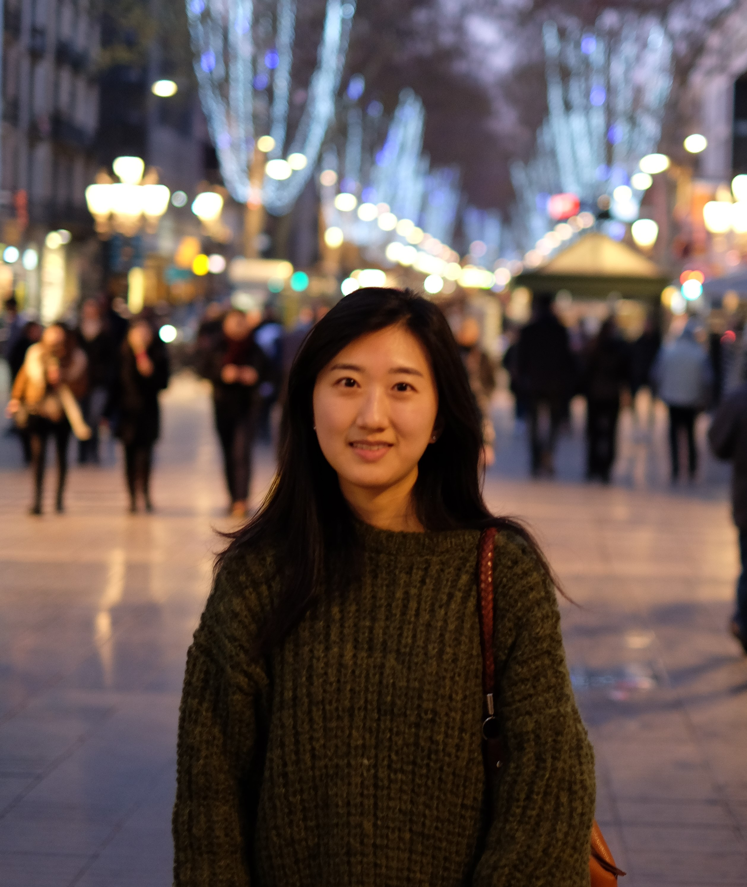

 

 

Hello! I am a master's student in Biostatistics at Columbia University. Prior to joining the program, I worked as a regulatory affairs associate at Pfizer and a pharmacovigilance associate at Merck&Co. in South Korea. I received a B.S. in Pharmacy from Ewha Womans University and a M.S. in Pharmacy from Seoul National University. I have a pharmacist license in South Korea.  
